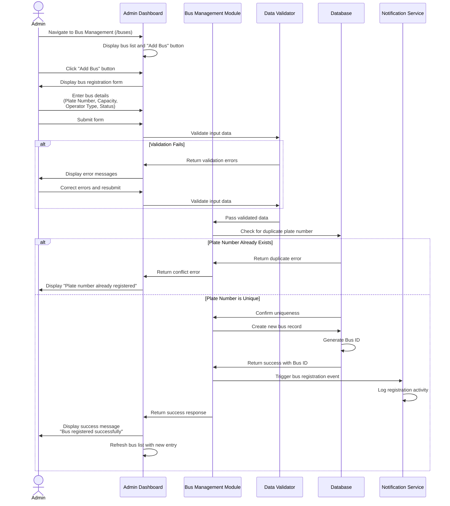
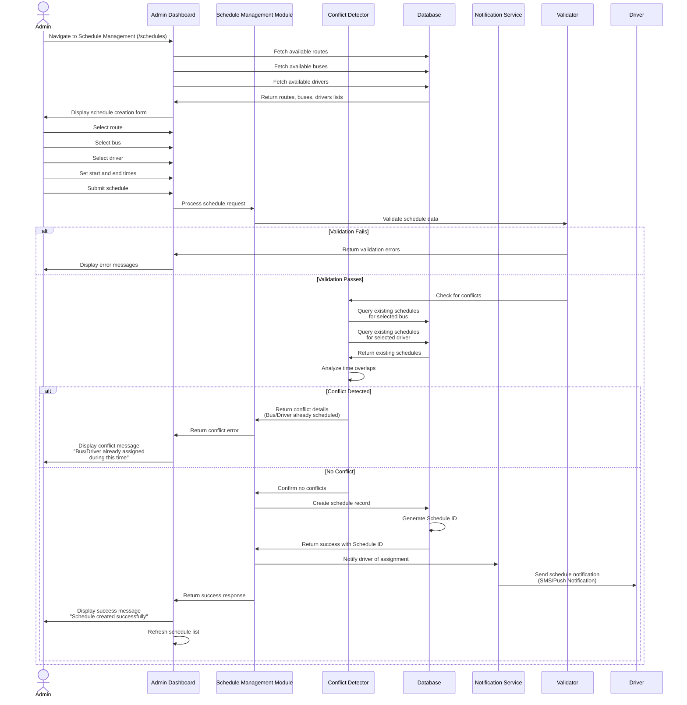
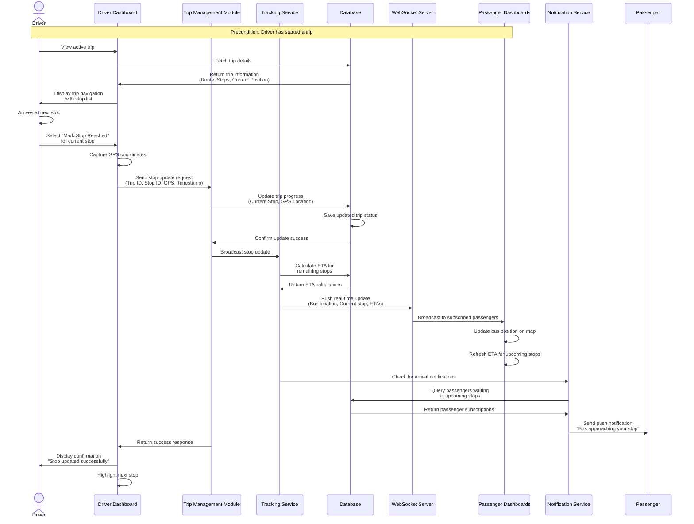
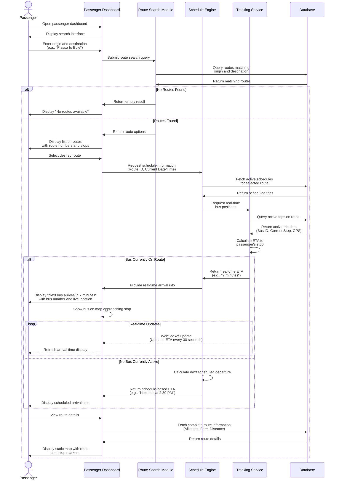

# Public Bus Tracking and Scheduling System (PBTS)
# Sequence Diagrams Documentation

## Overview
This document contains sequence diagrams for the major use cases of the Public Bus Tracking and Scheduling System for Ethiopian Cities. These diagrams illustrate the temporal ordering of messages and interactions between system actors and objects.

**System Actors:**
- **Admin**: Transport Authority/Administrator (AARTB, Anbessa, Sheger, Velocity operators)
- **Driver**: Bus driver operating the vehicle
- **Passenger**: End-user seeking bus information
- **System**: Backend server and database

---

## 1. Bus Registration Sequence Diagram

### Use Case Description
An administrator registers a new bus in the system, including details such as plate number, capacity, operator type, and assignment status.

### Actors Involved
- Admin (Transport Authority)
- Admin Dashboard Interface
- Bus Management Module
- Database

### Sequence Diagram

### Key Messages
1. **Navigate to Bus Management**: Admin accesses the bus management interface
2. **Enter bus details**: Admin inputs plate number, capacity, operator type (Anbessa/Sheger/Velocity), and status
3. **Validate input data**: System checks data format and completeness
4. **Check for duplicate**: Database verifies plate number uniqueness
5. **Create bus record**: New bus entity is persisted in the database
6. **Return success**: Admin receives confirmation of successful registration

---

## 2. Schedule Creation Sequence Diagram

### Use Case Description
An administrator creates a bus schedule by assigning a bus and driver to a specific route with defined start and end times. The system automatically detects scheduling conflicts.

### Actors Involved
- Admin (Transport Authority)
- Schedule Management Module
- Conflict Detection Service
- Database

### Sequence Diagram

### Key Messages
1. **Fetch available resources**: System retrieves lists of routes, buses, and drivers
2. **Select schedule parameters**: Admin chooses route, bus, driver, and time range
3. **Check for conflicts**: Conflict detector analyzes existing schedules for overlapping assignments
4. **Create schedule record**: If no conflicts, schedule is saved to database
5. **Notify driver**: Driver receives notification of new schedule assignment

---

## 3. Real-time Tracking Sequence Diagram

### Use Case Description
A driver updates their current bus stop during an active trip, enabling real-time tracking. The system updates the bus location and broadcasts this information to passengers viewing the route.

### Actors Involved
- Driver
- Driver Dashboard
- Tracking Service
- Database
- Passenger Dashboard
- Notification Service

### Sequence Diagram

### Key Messages
1. **View active trip**: Driver accesses current trip information
2. **Mark stop reached**: Driver indicates arrival at a stop
3. **Update trip progress**: System records new current stop and GPS coordinates
4. **Calculate ETA**: System computes estimated arrival times for remaining stops
5. **Broadcast update**: WebSocket pushes real-time data to passenger dashboards
6. **Send notifications**: Passengers waiting at upcoming stops receive arrival alerts

---

## 4. Passenger Viewing Bus Arrival Time Sequence Diagram

### Use Case Description
A passenger searches for a route and views the estimated arrival time of the next bus at their desired stop.

### Actors Involved
- Passenger
- Passenger Dashboard
- Route Search Module
- Schedule Engine
- Tracking Service
- Database

### Sequence Diagram

### Key Messages
1. **Enter search query**: Passenger specifies origin and destination locations
2. **Query matching routes**: System searches database for routes connecting the locations
3. **Fetch schedules**: System retrieves timetable information for the selected route
4. **Request real-time positions**: Tracking service provides live bus locations
5. **Calculate ETA**: System computes estimated arrival time based on current bus position and speed
6. **Display arrival information**: Passenger sees real-time or scheduled arrival time
7. **Real-time updates**: WebSocket continuously refreshes ETA as bus moves

---

## Diagram Notations and Conventions

### UML Sequence Diagram Elements Used

1. **Actor** (Stick figure): External entities interacting with the system
   - Admin, Driver, Passenger

2. **Objects/Components** (Boxes): System components and modules
   - UI Dashboards, Modules, Services, Database

3. **Lifelines** (Vertical dashed lines): Represent the lifespan of objects during the interaction

4. **Messages** (Arrows):
   - **Solid arrow (→)**: Synchronous call action (sender waits for response)
   - **Dashed arrow (⇢)**: Return value or response
   - **Dotted arrow (-->>)**: Asynchronous message (e.g., WebSocket updates)

5. **Activation Boxes**: Represent the period during which an object is processing a message

6. **Alt Fragment**: Shows alternative flows (if-else logic)

7. **Loop Fragment**: Represents repeated actions

8. **Note**: Provides additional context or preconditions

### Design Principles Applied

1. **Separation of Concerns**: Each module has a specific responsibility
2. **Validation-First**: Input validation occurs before business logic
3. **Conflict Detection**: Automated checking prevents scheduling errors
4. **Real-time Communication**: WebSocket enables live updates to passengers
5. **Notification System**: Proactive alerts keep stakeholders informed
6. **Error Handling**: Alternative flows handle validation failures and conflicts

---

## System Objects and Responsibilities

### Admin Dashboard Objects
- **Bus Management Module**: Handles CRUD operations for buses
- **Schedule Management Module**: Creates and manages schedules
- **Data Validator**: Ensures data integrity and format
- **Conflict Detector**: Identifies scheduling conflicts

### Driver Dashboard Objects
- **Trip Management Module**: Controls trip lifecycle (start, update, end)
- **Tracking Service**: Manages real-time location updates

### Passenger Dashboard Objects
- **Route Search Module**: Finds routes matching passenger queries
- **Schedule Engine**: Provides timetable information
- **Tracking Service**: Delivers real-time bus positions and ETAs

### Shared Services
- **Database**: Persistent storage for all system data
- **WebSocket Server**: Enables real-time bidirectional communication
- **Notification Service**: Sends alerts via SMS/Push notifications

---

## Implementation Notes

### Technology Stack
- **Frontend**: Next.js with TypeScript, Tailwind CSS
- **Backend**: Node.js, GraphQL, Apollo Server
- **Database**: MongoDB with Prisma ORM
- **Real-time**: WebSocket for live updates
- **Authentication**: JWT-based secure access

### Key Features Illustrated
1. **Data Validation**: All user inputs are validated before processing
2. **Duplicate Prevention**: System checks for existing records
3. **Automated Conflict Detection**: Prevents double-booking of buses/drivers
4. **Real-time Updates**: Live tracking via WebSocket connections
5. **ETA Calculation**: Dynamic arrival time estimation based on GPS data
6. **Notification System**: Proactive alerts for drivers and passengers

### Alignment with Requirements
These sequence diagrams directly support the functional requirements outlined in Chapter 2:
- ✅ Bus and Driver Registration (Use Case 1)
- ✅ Route and Schedule Management (Use Case 2)
- ✅ Real-time Tracking (Use Case 3)
- ✅ Passenger Information Access (Use Case 4)
- ✅ Automated Conflict Detection (Use Case 2)
- ✅ Incident Management (Extensible from Use Case 3)

---

## References
- **Chapter 1**: System Overview and Objectives
- **Chapter 2**: Business Area Analysis and Requirements
- **Admin Dashboard**: Bus, Driver, Route, Schedule, Feedback, Incident Management
- **Driver Dashboard**: Trip Management, Navigation, Incident Reporting
- **Passenger App**: Route Search, Real-time Tracking, Journey Planning

---

*Generated for: Public Bus Tracking and Scheduling System (PBTS)*  
*Project Team: Addis Ababa University - School of Information Science*  
*Date: November 2025*
